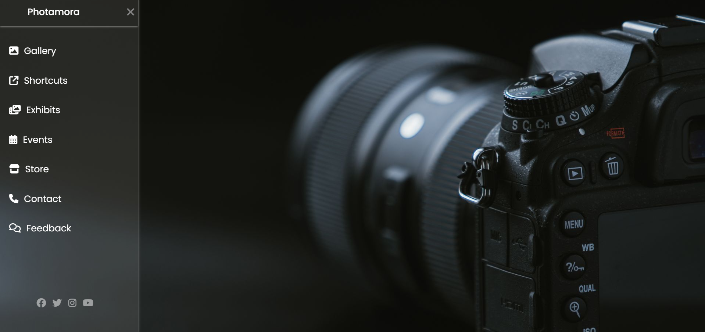

# SideMenuBar

This repository contains code for a responsive sidebar menu built using HTML, CSS, and Font Awesome icons.

## Preview

## Features

- Responsive design suitable for various screen sizes.
- Uses Font Awesome icons for visual representation.
- Toggle functionality for opening and closing the sidebar menu.
- Easily customizable styles to match your project's theme.

## Usage

1. Clone this repository to your local machine.
2. Open the `index.html` file in your web browser to view the sidebar menu.
3. Click on the toggle button to open and close the sidebar menu.
4. Customize the menu items and styles according to your project requirements.

## Dependencies

- [Font Awesome](https://fontawesome.com/): Used for icons in the sidebar menu.
- [Google Fonts - Poppins](https://fonts.google.com/specimen/Poppins): Font family used for text elements.

## Credits

- Font Awesome - Icons
- Google Fonts - Poppins

